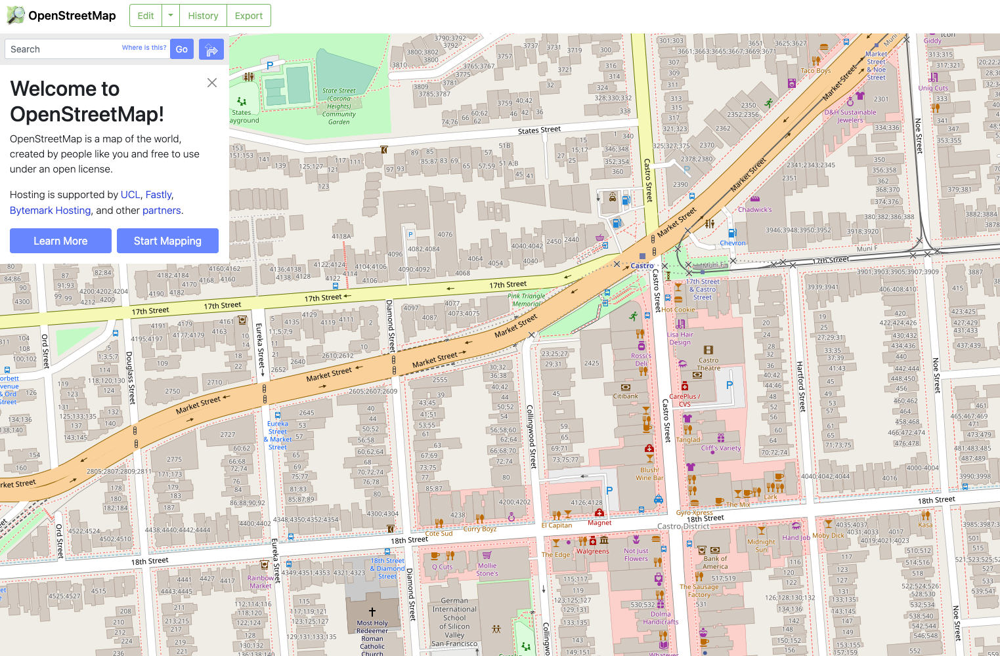
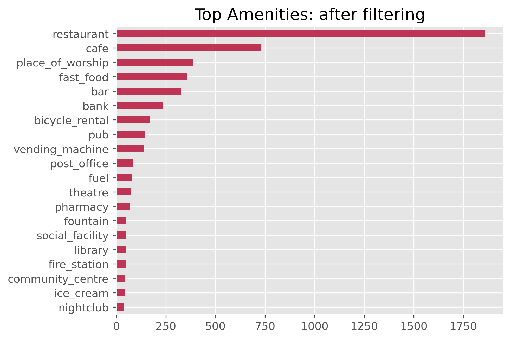
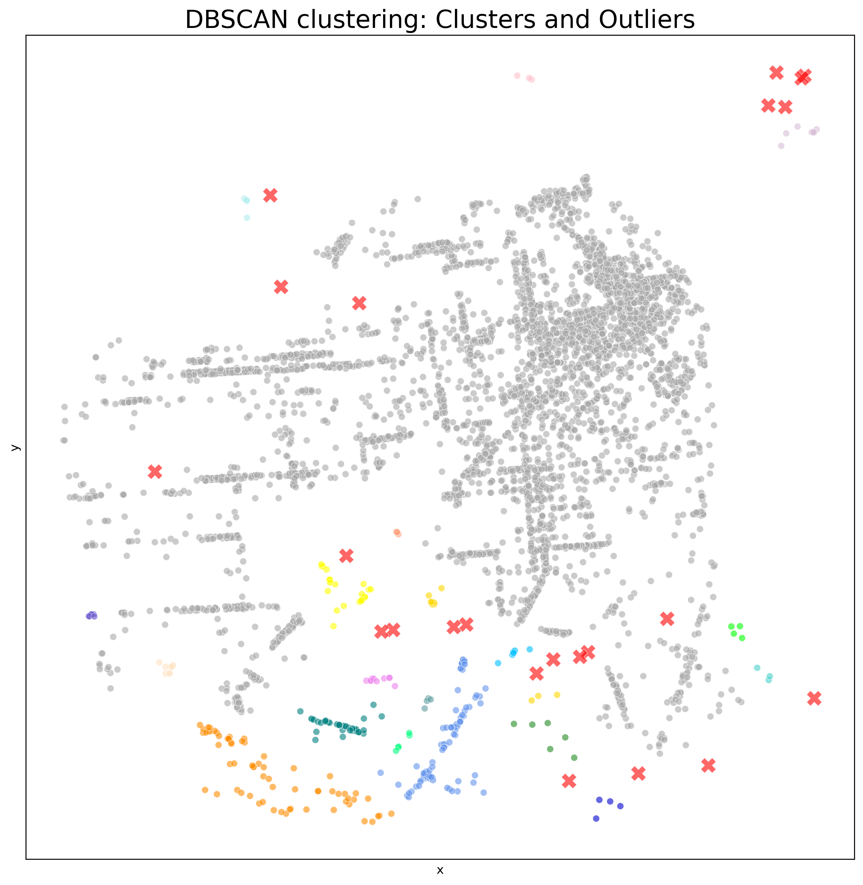
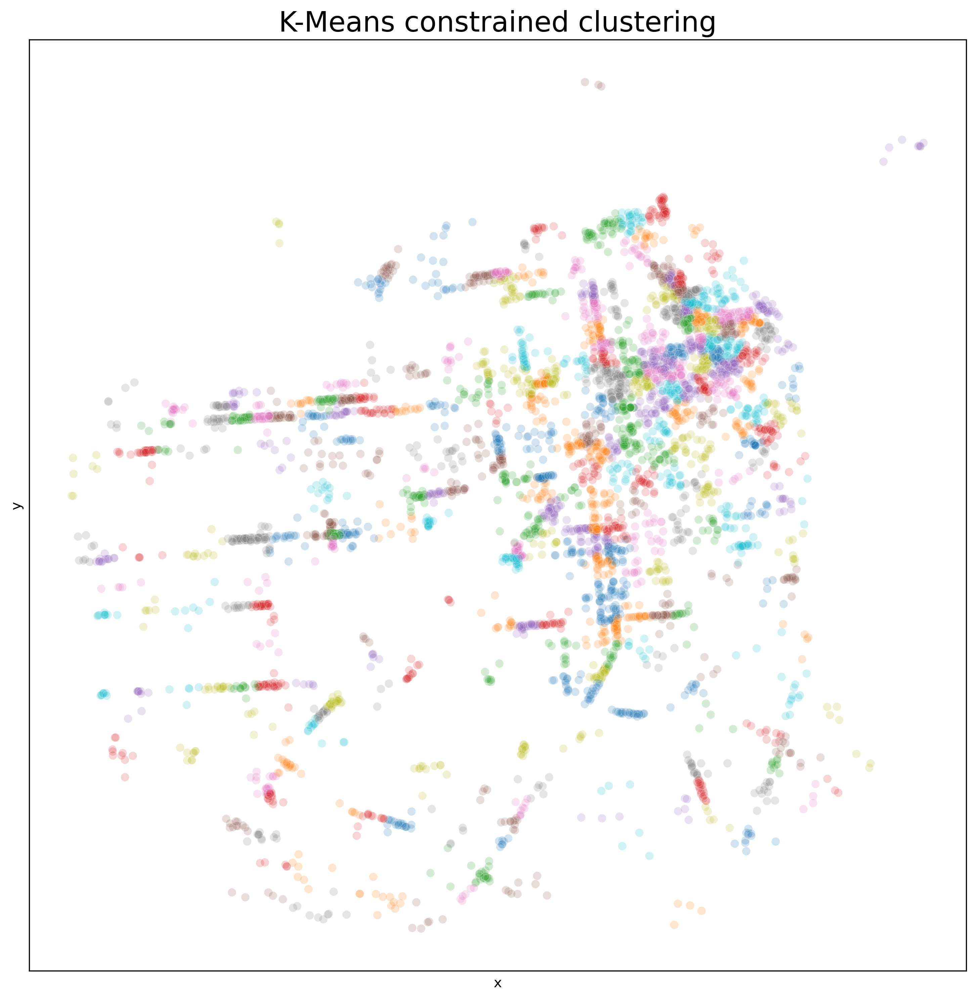

# Developing a Content-based Recommender System of potential Clusters of interest in a City of San Francisco

## Table of Contents
* [Data Collection: OpenStreetMaps](./code/01_data_collection.ipynb)
* [Feature Engineering](./code/02_feature_engineering.ipynb)
* [Clustering of Points of interest](./code/03_geospatial_clustering.ipynb)
* [Developing a recommender system](./code/04_recommender_system.ipynb)

---
## Problem Statement
The goal of the project was to develop a Recommender system that suggests user five top clusters of points of interest in a city based on their previous preference.

---
## Libraries
Basic data science toolbox:
* pandas, numpy, matplotlib, seaborn
* sklearn: clustering algorythms and cosine similarity
* [K-Means constrained](https://joshlk.github.io/k-means-constrained/) - Advanced K-Means that allows to set min and max cluster size

Libraries for Geo Data:
* OSMnx mentioned above to collect OSM data
* [GeoPandas](https://geopandas.org/en/stable/) is an open source python library which is a geospatial extention of widely used pandas, but with an addition of geometrical functionality on top. Shapely often goes with it
* [Folium](https://python-visualization.github.io/folium/) - interactive mapping library built for python based on leaflet.js
* [TileMapBase](https://github.com/MatthewDaws/TileMapBase) - for quick static maps with OSM data on the background
* [Datashader](https://datashader.org/) (and Colorcet for color palette) - Good for plotting large datasets.

---
## Data: OpenStreetMaps
All objects with tag "Amenity" for the City of San Francisco. Data was queried using OSMnx library. 

---
## Feature Engineering
Some amenities were represented as ways aka polygons, so I had to convert them into points. Also dataset required reprojection to the Web Mercator to make clustering easier.
I filtered amenities to the ones I considered as most relevant, removing everything related to transit, parks and "non-vibrant" feature like ATM. 
Tags/features also were selected in a way so only the most important ones participated in similarities calculation. 
The final dataset consists of 5247 observations and 295 features where column = tag and its presence is coded as 1.

---
## Clustering
Based on the project scope cluster had to match following guidelines, some of them are also very subjective and based on my very personal taste:
- Cluster size is maximum one kilometer which makes it somewhat walkable
- Minimum number of points to form a cluster - 3
- Number of clusters isn't important
- Cluster density isn't important

I tried four clustering algorithms, and each of them added some value to the process. First, I utilized DBSCAN to remove outliers - points that weren't merged into any of clusters because of being more than 500 meters apart from at least any two other points. After that I attempted another unsupervised clustering algorithm - MeanShift which produced too large clusters. Knowing the approximate number of clusters to produce, I tried running KMeans to reduce the clusters' size while searching over several values of clusters' numbers. The problem with K-Means was that it produced clusters with less than 3 points, otherwise clusters with at least 3 points were too large. After that I've tried Constrained K-Means clustering technique which made it to the production model.

---
## Data aggregation and Recommender System
All tags were summed up together per cluster which became the basis for the Recommender System which was built based on the Cosine Similarity

----
## Potential Improvements
Including more points, like grocery shops. Proximity to the objects like water bodies or vegetation. Adding user input and develop the Recommender System based on the feedback recieved. 
